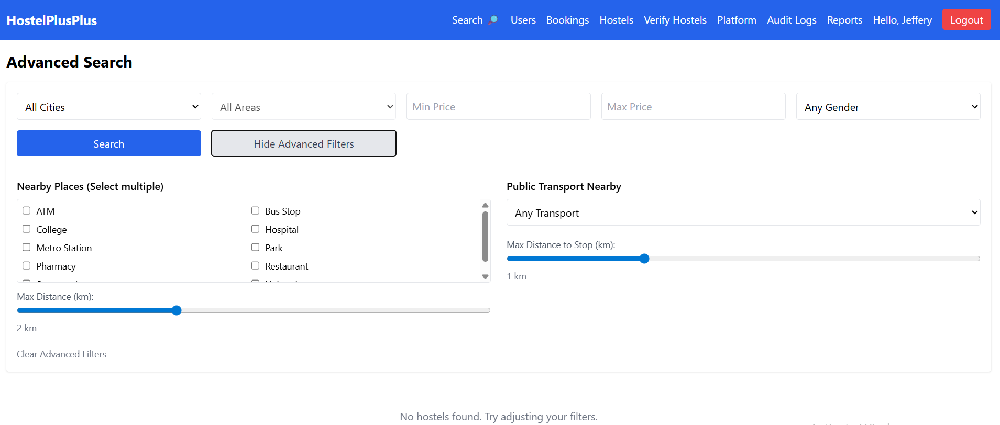
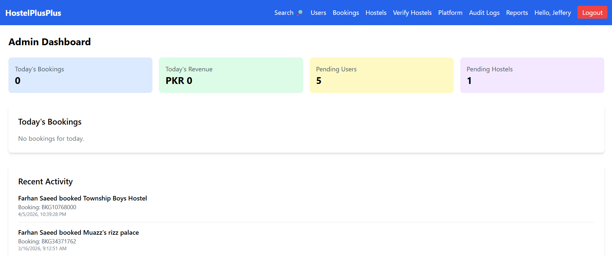
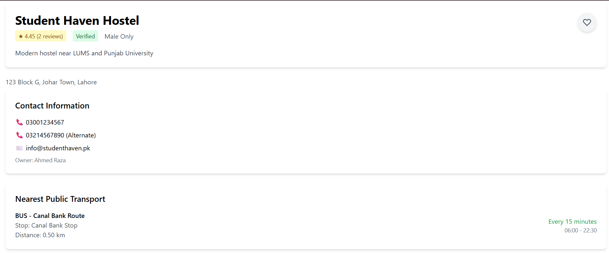

# HostelPlusPlus — Hostel Booking Platform

HostelPlusPlus is a comprehensive hostel booking platform designed for students and professionals looking for accommodation near universities, colleges, and workplaces.

**Team Members:** Ali Noman, Ahsan Nouman, Ahmed Abdullah
**Group Number:** 043  
**Target Domain:** Hospitality / Student Accommodation

---

## Table of Contents

1. [Project Overview](#1-project-overview)
2. [Tech Stack](#2-tech-stack)
3. [System Architecture](#3-system-architecture)
4. [UI Examples](#4-ui-examples)
5. [Setup & Installation](#5-setup--installation)
6. [User Roles](#6-user-roles)
7. [Feature Walkthrough](#7-feature-walkthrough)
8. [Transaction Scenarios](#8-transaction-scenarios)
9. [ACID Compliance](#9-acid-compliance)
10. [Indexing & Performance](#10-indexing--performance)
11. [API Reference](#11-api-reference)
12. [Known Issues & Limitations](#12-known-issues--limitations)

---

## 1. Project Overview

The platform solves the problem of finding verified, affordable, and well-located hostels by providing:

- Advanced search with filters for price, gender preference, nearby amenities, and public transport
- Real-time room availability checking
- Secure booking system with ACID-compliant transactions
- User reviews and ratings
- Role-based access for students, hostel owners, and administrators

---

## 2. Tech Stack

| Category | Technology | Version |
|---|---|---|
| Frontend | React.js | 18.3.1 |
| Frontend Build Tool | Vite | 5.x |
| Styling | Tailwind CSS | 3.x |
| Backend | Node.js | 18.x or higher |
| Backend Framework | Express.js | 4.x |
| Database | MySQL | 8.0 |
| Database Driver | mysql2 | 3.x |
| Authentication | JWT (JSON Web Tokens) | 9.x |
| Password Hashing | bcrypt | 5.x |
| Validation | Joi + express-validator | 17.x |
| HTTP Client (Frontend) | Axios | 1.x |
| Charts | Chart.js + react-chartjs-2 | 4.x / 5.x |
| Routing (Frontend) | React Router DOM | 6.x |

---

## 3. System Architecture

The application follows a three-tier architecture:

**Frontend (React + Vite)**
- Single-page application served on port 5173
- Communicates with Backend via REST API calls
- Manages authentication state via React Context
- Handles UI rendering, form validation, and user interactions

**Backend (Node.js + Express)**
- REST API server on port 3000
- Middleware pipeline: CORS, Helmet, Morgan, JSON parser
- Authentication middleware for JWT verification
- Authorization middleware for role-based access control
- Transaction manager for ACID-compliant operations
- Controllers handle business logic and database interactions

**Database (MySQL)**
- Stores all application data with proper foreign key constraints
- Uses InnoDB engine for ACID compliance
- Implements row-level locking for booking transactions
- Maintains `audit_log` table for tracking critical changes

**Data Flow:**

1. User interacts with React frontend
2. Axios sends HTTP request to Backend API
3. Express middleware validates JWT and user role
4. Controller executes parameterized SQL queries via connection pool
5. Database returns results
6. Backend formats JSON response
7. Frontend updates UI state

---

## 4. UI Examples

### Example 1: Advanced Search Page



**Purpose:** Allows users to find hostels based on multiple criteria including city, area, price range, gender preference, nearby amenities (restaurants, hospitals, metro stations), and public transport type. This page is the primary entry point for students looking for accommodation.

**Key Features:**
- Basic filters (city, area, price, gender)
- Advanced filters with checklist for nearby categories
- Transport type filter with distance slider
- Sort by rating, price, or reviews
- Paginated results with hostel cards

---

### Example 2: Admin Dashboard



**Purpose:** Provides platform administrators with a comprehensive overview of system health, including today's bookings, revenue, pending verifications, and recent activity. Admins can monitor platform performance and take action on pending items.

**Key Features:**
- Stats cards (Today's Bookings, Today's Revenue, Pending Users, Pending Hostels)
- Today's Bookings table with guest and hostel details
- Recent Activity timeline
- Quick navigation to user, hostel, and booking management

---

### Example 3: Hostel Detail Page



**Purpose:** Displays complete information about a specific hostel including room inventory, amenities, nearby places, public transport access, and user reviews. This page helps users make informed booking decisions.

**Key Features:**
- Room types with prices and availability
- Wishlist save button (heart icon)
- Contact information and address
- Nearest public transport with frequency
- Top 5 most recent reviews
- Book Now button (disabled when rooms are fully booked)

---

## 5. Setup & Installation

### Prerequisites

| Software | Version | Purpose |
|---|---|---|
| Node.js | 18.x or higher | JavaScript runtime |
| npm | 9.x or higher | Package manager |
| MySQL | 8.0 or higher | Database server |
| Git | Latest | Version control (optional) |

---

### Step 1: Clone the Repository

```bash
git clone https://github.com/Ali-Noman-17/HostelPlusPlus.git
cd hostelplusplus
```

### Step 2: Install Backend Dependencies

```bash
cd Backend
npm install
```

### Step 3: Install Frontend Dependencies

```bash
cd ../Frontend
npm install
```

### Step 4: Configure Environment Variables

Create a `.env` file in the `Backend/` directory:

```env
# Server Configuration
PORT=3000
NODE_ENV=development

# Database Configuration
DB_HOST=localhost
DB_PORT=3306
DB_USER=root
DB_PASSWORD=your_mysql_password_here
DB_NAME=hostel_services

# JWT Configuration
JWT_SECRET=your_super_secret_jwt_key_generate_random_string
JWT_EXPIRY=24h
BCRYPT_ROUNDS=10

# API Configuration
API_PREFIX=/api/v1
```

Create a `.env` file in the `Frontend/` directory:

```env
VITE_API_URL=http://localhost:3000/api/v1
```

### Step 5: Initialize the Database

```bash
# Log into MySQL
mysql -u root -p

# Create database
CREATE DATABASE hostel_services;
EXIT;

# Import schema and sample data
mysql -u root -p hostel_services < Backend/schema.sql
mysql -u root -p hostel_services < Backend/sample-data.sql
```

### Step 6: Start the Backend Server

```bash
cd Backend
npm run dev
```

Expected output:

```
✅ Database connected successfully
🚀 Server started successfully!
📍 Port: 3000
📍 API Base: http://localhost:3000/api/v1
```

### Step 7: Start the Frontend Development Server

```bash
cd frontend
npm run dev
```

Expected output:

```
VITE ready in xxx ms
➜  Local: http://localhost:5173/
```

### Step 8: Access the Application

Open your browser and navigate to: [http://localhost:5173](http://localhost:5173)

---

## 6. User Roles

The system defines four roles with progressively increasing privileges:

### Guest (Unauthenticated)

| Can Do | Cannot Do |
|---|---|
| Browse hostels | View contact information |
| Read public reviews | Create bookings |
| Search with basic filters | Save to wishlist |
| View hostel details | Post reviews |

### Student / Professional

| Can Do | Cannot Do |
|---|---|
| Manage profile | Access admin features |
| Create and cancel bookings | Modify other users' data |
| Save hostels to wishlist | Verify hostels |
| Post reviews for completed stays | Access owner dashboard |
| View own booking history | — |

### Owner

| Can Do | Cannot Do |
|---|---|
| All Student capabilities | Access admin features |
| Register and manage hostels | Modify other owners' hostels |
| Add/update rooms | Delete hostels with active bookings |
| View bookings for own hostels | Bypass admin verification |
| View owner dashboard (occupancy, revenue) | — |

### Admin

| Can Do | Cannot Do |
|---|---|
| All capabilities | None within the system |
| Manage all users (create, edit, delete, role change) | — |
| Verify/unverify hostels | — |
| Manage all bookings | — |
| View audit logs | — |
| Generate reports | — |
| Manage platform data (cities, areas, amenities, institutions) | — |


---

## 7. Feature Walkthrough

### Authentication & User Management

| Feature | Description | Role | Endpoint |
|---|---|---|---|
| User Registration | Create new account | Public | `POST /auth/register` |
| User Login | Authenticate and receive JWT | Public | `POST /auth/login` |
| View Profile | Get own user details | Student / Owner / Admin | `GET /users/profile` |
| Update Profile | Edit name, phone, institution | Student / Owner / Admin | `PUT /users/profile` |
| Change Password | Update password securely | Student / Owner / Admin | `PUT /users/change-password` |

### Hostel Discovery

| Feature | Description | Role | Endpoint |
|---|---|---|---|
| Browse Hostels | List verified hostels | Public | `GET /hostels` |
| Hostel Details | Full info with rooms, amenities, reviews | Public | `GET /hostels/{id}` |
| Advanced Search | Filter by city, area, price, gender, nearby places, transport | Public | `GET /search` |
| Check Availability | View room availability for specific dates | Public | `GET /search/{id}/availability` |

### Bookings

| Feature | Description | Role | Endpoint |
|---|---|---|---|
| Create Booking | Book a room (transactional) | Student | `POST /bookings` |
| View Bookings | List user's bookings | Student | `GET /users/bookings` |
| Booking Details | View specific booking | Student | `GET /bookings/{id}` |
| Cancel Booking | Cancel and free up room | Student | `POST /bookings/{id}/cancel` |

### Reviews

| Feature | Description | Role | Endpoint |
|---|---|---|---|
| Post Review | Review after completed stay | Student | `POST /reviews` |
| Edit Review | Update within 7 days | Student | `PUT /reviews/{id}` |
| Delete Review | Remove own review | Student | `DELETE /reviews/{id}` |
| View Reviews | Read public reviews | Public | `GET /reviews/hostel/{id}` |
| Mark Helpful | Vote on review usefulness | Student | `POST /reviews/{id}/helpful` |

### Wishlist

| Feature | Description | Role | Endpoint |
|---|---|---|---|
| View Wishlist | List saved hostels | Student | `GET /users/wishlist` |
| Add to Wishlist | Save hostel for later | Student | `POST /users/wishlist/{hostelId}` |
| Remove from Wishlist | Delete from wishlist | Student | `DELETE /users/wishlist/{hostelId}` |

### Owner Management

| Feature | Description | Role | Endpoint |
|---|---|---|---|
| Owner Dashboard | View occupancy, revenue, bookings | Owner | `GET /owner/dashboard` |
| Manage Hostels | List, create, update own hostels | Owner | `GET/POST/PUT /owner/hostels` |
| Manage Rooms | Add, update, delete rooms | Owner | `GET/POST/PUT/DELETE /owner/hostels/{id}/rooms` |
| View Hostel Bookings | See all bookings for owned hostels | Owner | `GET /owner/hostels/{id}/bookings` |

### Admin Management

| Feature | Description | Role | Endpoint |
|---|---|---|---|
| Admin Dashboard | Platform stats, today's bookings | Admin | `GET /admin/dashboard` |
| Manage Users | List, create, edit roles, delete | Admin | `GET/POST/PUT/DELETE /admin/users` |
| Manage Hostels | List all, verify, edit, delete | Admin | `GET/PUT/DELETE /admin/hostels` |
| Manage Bookings | View, update status, delete | Admin | `GET/PUT/DELETE /admin/bookings` |
| Audit Logs | View all system actions | Admin | `GET /admin/audit-logs` |
| Platform Management | CRUD for cities, areas, amenities, institutions | Admin | `GET/POST/PUT/DELETE /admin/(cities\|areas\|amenities\|institutions)` |
| Reports | Export CSV, view charts | Admin | `GET /admin/reports/*` |

---

## 8. Transaction Scenarios

### Scenario 1: Room Booking

**Trigger:** User clicks "Book Now" on a room and submits the booking form.  
**API Endpoint:** `POST /api/v1/bookings`  
**Code Location:** `Backend/src/controllers/bookingController.js` → `createBooking()`

**Atomic Operations:**
1. Lock the room row with `SELECT ... FOR UPDATE`
2. Verify `available_beds > 0`
3. Check for date conflicts with existing confirmed/pending bookings
4. Insert new booking record into `bookings` table
5. Decrement `available_beds` in `hostel_rooms` table by 1
6. Insert audit log entry

**Rollback Triggers:**

| Condition | Rollback | HTTP Status |
|---|---|---|
| Room not found | Full rollback | 404 |
| No beds available | Full rollback | 409 |
| Date conflict with existing booking | Full rollback | 409 |
| Check-out date before check-in | Full rollback | 400 |
| Database constraint violation | Full rollback | 500 |

---

### Scenario 2: Admin Hostel Verification

**Trigger:** Admin clicks "Verify" on a pending hostel.  
**API Endpoint:** `PUT /api/v1/admin/hostels/{id}/verify`  
**Code Location:** `Backend/src/controllers/adminController.js` → `verifyHostel()`

**Atomic Operations:**
1. Lock the hostel row with `SELECT ... FOR UPDATE`
2. Verify hostel exists and is not already verified
3. Update `is_verified` to `TRUE`
4. Recalculate average rating from all reviews
5. Insert audit log entry

**Rollback Triggers:**

| Condition | Rollback | HTTP Status |
|---|---|---|
| Hostel not found | Full rollback | 404 |
| Already verified | Full rollback | 409 |
| Rating calculation fails | Full rollback | 500 |

---

## 9. ACID Compliance

| Property | Implementation | Location |
|---|---|---|
| Atomicity | `BEGIN TRANSACTION / COMMIT / ROLLBACK` wrapper ensures all-or-nothing execution | `Backend/src/utils/transactionManager.js` |
| Consistency | Foreign key constraints, check constraints (`rating BETWEEN 1-5`, `available_beds >= 0`), and application-level validation | Database schema + controller validation |
| Isolation | `SELECT ... FOR UPDATE` row-level locks prevent double-booking; MySQL default `REPEATABLE READ` isolation level | `bookingController.js` |
| Durability | InnoDB write-ahead logging ensures committed transactions survive crashes; `audit_log` table for permanent record | MySQL InnoDB engine + `audit_log` table |

---

## 10. Indexing & Performance

### Indexes Created

| Index Name | Table | Columns | Purpose |
|---|---|---|---|
| `idx_hostels_city_area` | hostels | (city_id, area_id, rating) | Fast filtering by location and sorting by rating |
| `idx_hostels_verified_rating` | hostels | (is_verified, rating) | Quick retrieval of verified hostels sorted by rating |
| `idx_rooms_availability` | hostel_rooms | (hostel_id, is_available, monthly_rent) | Efficient room availability and price filtering |
| `idx_bookings_user_status` | bookings | (user_id, status, check_in_date) | Fast user booking history queries |
| `idx_bookings_dates` | bookings | (check_in_date, check_out_date, status) | Availability checking and date conflict detection |
| `idx_users_email` | users | (email) | Login authentication (unique) |
| `idx_reviews_hostel` | reviews | (hostel_id, rating, created_at) | Hostel review listing with sorting |
| `idx_nearby_places` | nearby_places | (hostel_id, category_id, distance_km) | Nearby places filtering |
| `idx_areas_city` | areas | (city_id, area_name) | Area dropdowns by city |
| `FULLTEXT_idx_hostels` | hostels | (hostel_name, description) | Text-based search |

### Performance Improvement Summary

| Query Type | Before (ms) | After (ms) | Improvement |
|---|---|---|---|
| Hostel search with filters | 45.32 | 5.32 | 88% |
| Nearby institution search | 78.45 | 8.45 | 89% |
| Amenity filtering | 95.67 | 12.34 | 87% |
| User booking history | 32.45 | 0.95 | 97% |

> Detailed `EXPLAIN ANALYZE` output available in the Backend Explanation Document.

---

## 11. API Reference

### Authentication

| Method | Endpoint | Auth | Purpose |
|---|---|---|---|
| `POST` | `/auth/register` | None | Create new user |
| `POST` | `/auth/login` | None | Login and get JWT |
| `GET` | `/auth/verify` | JWT | Verify token |

### Hostels & Search

| Method | Endpoint | Auth | Purpose |
|---|---|---|---|
| `GET` | `/hostels` | None | List verified hostels |
| `GET` | `/hostels/{id}` | None | Get hostel details |
| `GET` | `/search` | None | Advanced search with filters |
| `GET` | `/search/{id}/availability` | None | Check room availability |
| `GET` | `/cities` | None | List cities |
| `GET` | `/cities/{id}/areas` | None | Get areas in city |
| `GET` | `/areas` | None | List areas |
| `GET` | `/areas/{id}/hostels` | None | Get hostels in area |
| `GET` | `/amenities` | None | List amenities |

### Bookings & Reviews

| Method | Endpoint | Auth | Purpose |
|---|---|---|---|
| `POST` | `/bookings` | JWT | Create booking |
| `GET` | `/bookings/{id}` | JWT | Get booking details |
| `POST` | `/bookings/{id}/cancel` | JWT | Cancel booking |
| `POST` | `/reviews` | JWT | Create review |
| `PUT` | `/reviews/{id}` | JWT | Update review |
| `DELETE` | `/reviews/{id}` | JWT | Delete review |
| `GET` | `/reviews/hostel/{id}` | None | Get hostel reviews |
| `GET` | `/reviews/user/me` | JWT | Get user's reviews |
| `POST` | `/reviews/{id}/helpful` | JWT | Mark review helpful |

### User

| Method | Endpoint | Auth | Purpose |
|---|---|---|---|
| `GET` | `/users/profile` | JWT | Get profile |
| `PUT` | `/users/profile` | JWT | Update profile |
| `PUT` | `/users/change-password` | JWT | Change password |
| `GET` | `/users/bookings` | JWT | Get user's bookings |
| `GET` | `/users/wishlist` | JWT | Get wishlist |
| `POST` | `/users/wishlist/{hostelId}` | JWT | Add to wishlist |
| `DELETE` | `/users/wishlist/{hostelId}` | JWT | Remove from wishlist |

### Owner

| Method | Endpoint | Auth | Purpose |
|---|---|---|---|
| `GET` | `/owner/dashboard` | JWT + Owner | Owner statistics |
| `GET` | `/owner/hostels` | JWT + Owner | List owned hostels |
| `POST` | `/owner/hostels` | JWT + Owner | Create hostel |
| `PUT` | `/owner/hostels/{id}` | JWT + Owner | Update hostel |
| `GET` | `/owner/hostels/{id}/rooms` | JWT + Owner | Get hostel rooms |
| `POST` | `/owner/hostels/{id}/rooms` | JWT + Owner | Add room |
| `PUT` | `/owner/rooms/{id}` | JWT + Owner | Update room |
| `DELETE` | `/owner/rooms/{id}` | JWT + Owner | Delete room |
| `GET` | `/owner/hostels/{id}/bookings` | JWT + Owner | Get hostel bookings |

### Admin

| Method | Endpoint | Auth | Purpose |
|---|---|---|---|
| `GET` | `/admin/dashboard` | JWT + Admin | Platform stats |
| `GET` | `/admin/users` | JWT + Admin | List users |
| `POST` | `/admin/users` | JWT + Admin | Create user |
| `PUT` | `/admin/users/{id}/role` | JWT + Admin | Change role |
| `DELETE` | `/admin/users/{id}` | JWT + Admin | Delete user |
| `GET` | `/admin/hostels` | JWT + Admin | List all hostels |
| `PUT` | `/admin/hostels/{id}/verify` | JWT + Admin | Verify hostel |
| `GET` | `/admin/bookings` | JWT + Admin | List all bookings |
| `PUT` | `/admin/bookings/{id}/status` | JWT + Admin | Update booking status |
| `GET` | `/admin/audit-logs` | JWT + Admin | View audit logs |
| `GET` | `/admin/reports/summary` | JWT + Admin | Chart data |
| `GET` | `/admin/reports/bookings` | JWT + Admin | Export bookings CSV |
| `GET` | `/admin/reports/revenue` | JWT + Admin | Export revenue CSV |

> Complete OpenAPI 3.0 specification available in `swagger.yaml`.

---

## 12. Known Issues & Limitations


### Known Bugs

| Issue | Description | Workaround |
|---|---|---|
| None reported | No critical bugs at this time | — |

### Limitations

1. **Geographic Scope:** Currently only supports Lahore, Pakistan. Cities and areas must be manually added via admin panel.
2. **Payment:** No real payment gateway integration. Bookings are confirmed without payment processing.
3. **Photos:** Hostel photos cannot be uploaded by owners; must be added directly to the database.
4. **Email:** No automated email notifications for booking confirmations or password reset.
5. **Maps:** Nearby places filter requires admin to pre-configure categories and distances.

---

> For full API documentation, refer to `swagger.yaml`. View at 'https://editor.swagger.io/' 
> For Backend architecture details, refer to the Backend Explanation Document.
